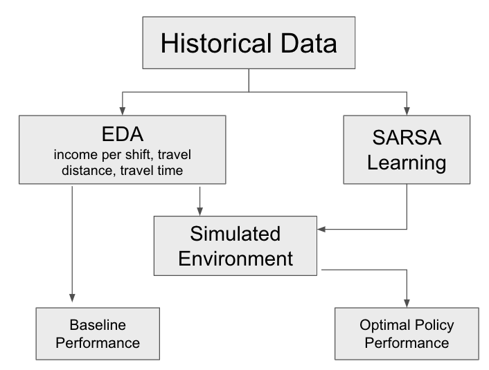
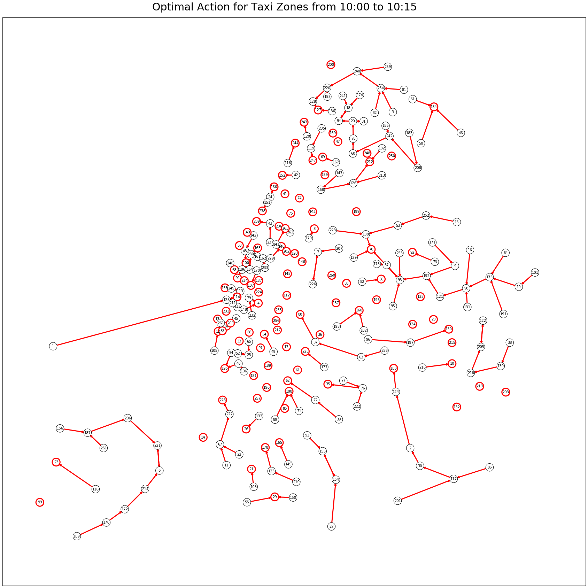

# Reinforcement Learning for Taxi Driver Re-positioning Problem in NYC

## Project overview
In this project, we focus on the taxi driver re-positioning problem, i.e. when and where to start the shift and where to cruise to in order to maximize a driver's income. We aim to find the best spatially and temporally varied policies that maximize drivers' daily earning using reinforcement learning.

Here is a project flowchart:



Firstly, we explore and clean NYC Taxi Trip Record dataset. 

Then, we conduct numerous estimations and build a reinforcement learning environment to simulate demand for NYC taxi.

Lastly, we apply SARSA, a widely-used algorithm to historical data and trained best policy.

An additional video can be seen at [this Youtube link](https://www.youtube.com/watch?v=-o6KtIySaiU&feature=youtu.be&ab_channel=Stelllaaaiii113).

## Key results
1. In the simulated environment, drivers earn \$215 in one shift by following the empirical policy, and earn \$236 by following the derived policy, which means that drivers can earn 9\% more per shift if following the new policy

2. We find an optimal action for each taxi zone at any given time. The following plot show an example of optimal action from 10:00 to 10:15 in NYC. You can also zoom in the map and change time interactively in [this notebook](notebook/interactive_q_plot.ipynb)


## Dataset
The data that we use is publicly available: [NYC Taxi Trip Record data](https://databank.illinois.edu/datasets/IDB-9610843). The dataset contains Yellow Taxi trip records since January 2009, Green Taxi trip records since August 2013 and FHV trip records since January 2015. It's noteworthy that more recent data is also available, but they lack a key feature: trip fare. Therefore, we decide to use data of previous years.

Due to computational limitation, we choose Yellow Taxi trip records in June 2013 as our training data. Data of one month contain sufficient information we need to proceed. 

## Files
To accelerate the training process, we pre-processed the dataset and stored the processed data, that is, all the computation and estimation processes are done using the files in the [Pre-processing and training files](#pre-processing-and-training-files) section. The [Functional files](#functional-files) are used for loading the processed data and training the model. If you want to run those files, we suggest you run the files in order as they produced some data file that are used by other files as the inputs.

### Pre-processing and training files
1. Data fetching and cleaning - [convert_to_zone_xx.ipynb](notebooks/convert_to_zone_xx.ipynb)+[EDA_activetime_dist.ipynb](notebooks/EDA_activetime_dist.ipynb). The file contains all the data cleaning process and visualization of some raw features, such as driver income, trip time, trip distance, etc. We stored our the dataset into a database on AWS after converting coordinates to taxi zones. An example of acceessing the database is in [Accessing database.ipynb](notebooks/Accessing database.ipynb). Note that the database may be unavailable in the future. If that is the case, you can still access the dataset by using the link provided above and get the cleaned dataset by making some changes to those notebooks

2. Computation - files starts with "compute_" in "/notebook". Those files process the cleaned dataset to produce the estimation of values that are used for setting up the reinforcement learning environment, and prepare the dataset in SARSA algorithm format for training the model

3. Visualization - files starts with "EDA_" in "/notebook". Those files shows the visualization of processed features such as cruise time and repositioning decisions

4. Result - [OUTPUT_training_report.ipynb](notebook/OUTPUT_training_report.ipynb)+[interactive_q_plot.ipynb](notebook/interactive_q_plot.ipynb)+[train.ipynb](./train.ipynb). Those files shows the model convergence and optimal policy, and evaluate drivers' income

### Functional files
- [empirical_training.py](./empirical_training.py) - implementing training process
- [estimations.py](./estimations.py) - loading the estimators into the simulated environment
- [environment.py](./environment.py) - building the simulated environment
- [algorithms.py](./algorithms.py) - SARSA algorithm
- [tosarsa.py](./tosarsa.py) - converting dataset into SARSA format for training
- [plotting.py](./plotting.py) - supportive functions for SARSA
- [utils.py](./utils.py) - supportive functions for plotting training results 

## Software Requirements
To do

## Acknowledgements
We would like to express our gratitude to [Vineet Goyal](http://www.columbia.edu/~vg2277/), [Zhiwei Qin](https://www.linkedin.com/in/ztqin), [Shuaiji Li](https://www.linkedin.com/in/shuaiji) and [Qun Li](https://cn.linkedin.com/in/tracy-li-15766142) for mentoring us through-out the term. They have guided us in each phase of the projectand provided invaluable advice when we encountered technical obstacles. We would also love to thank Sining Chen, AdamKelleher and Eleni Drinea for organizing this capstone projectand providing us with this unique opportunity to apply theoryto practice.

## Organization of this directory
```
©¦  algorithms.py
©¦  empirical_training.py
©¦  environment.py
©¦  estimations.py
©¦  plotting.py
©¦  README.md
©¦  tosarsa.py
©¦  train.ipynb
©¦  utils.py
©¦  
©À©¤fig
©¦      cruise_time_quantiles_2.png
©¦      driver_income.png
©¦      flowchart.png
©¦      heatmap_cruise_time_adjacent_avg_interval15.png
©¦      heatmap_cruise_time_adjacent_avg_minute.png
©¦      heatmap_cruise_time_adjacent_sample_interval15.png
©¦      heatmap_cruise_time_adjacent_sample_minute.png
©¦      optimal_q.png
©¦      pick_drop_time_wk(k_5).png
©¦      shift_range.png
©¦      simulated_active_times.png
©¦      trip_time_and_trip_distance.png
©¦      trip_time_and_trip_distance_ratio.png
©¦      trip_time_and_trip_distance_weekday_weekend.png
©¦      
©¸©¤notebooks
        Accessing database.ipynb
        compute_adjacent_zone.ipynb
        compute_cruise_time.ipynb
        compute_cruise_time_adjacent_average.ipynb
        compute_cruise_time_adjacent_sample.ipynb
        compute_dropoff_zone_probability.ipynb
        compute_earning_and_utilization.ipynb
        compute_empirical_policy_Q.ipynb
        compute_fare_distance_time.ipynb
        compute_impute_opt_Q.ipynb
        compute_matching_prob.ipynb
        compute_SARSA_episode.ipynb
        compute_SARSA_episode_v02.ipynb
        convert_to_zone_xx.ipynb
        EDA_activetime_dist.ipynb
        EDA_cruise_time.ipynb
        EDA_cruise_time_adjacent_average.ipynb
        EDA_cruise_time_adjacent_sample.ipynb
        EDA_income.ipynb
        EDA_reposition_adjacent_distribution.ipynb
        EDA_reposition_distribution.ipynb
        EDA_trip_time_and_trip_distance_rel.ipynb
        interactive_q_plot.ipynb
        matching_prob_plot.ipynb
        OUTPUT_training_report.ipynb
        plot_start_end_time.ipynb
```     